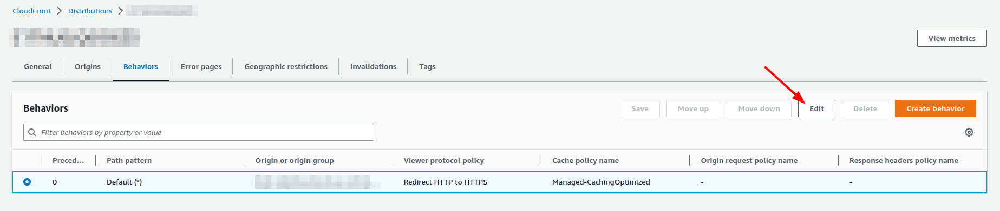
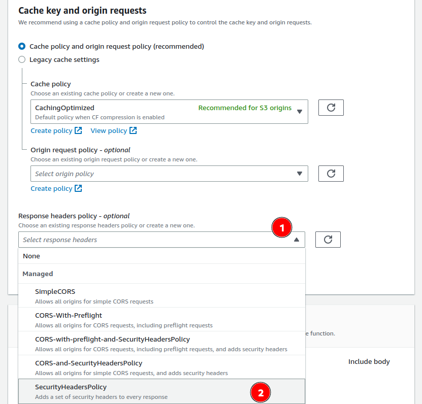

– Did you just say security headers?

– Yes.

– Are you talking about CORS headers?

– No.

# HTTP security headers: a very simple addition to your website to efficiently prevent attacks

I have learnt about HTTP security headers very late in my full stack developer carrier. In the last 5 years, have worked in a dozen teams to develop and run web applications.

This is only very recently, when I joined [Theodo](https://www.theodo.fr/), that I was explained what HTTP security headers actually are. 😮

HTTP security headers are seemingly unknown to many full stack developers.

HTTP security headers are a mechanism to **protect your application from common attacks**. HTTP security headers are, as their name suggests, a set of HTTP headers with security purposes.

The table below shows a subset of HTTP security headers. The value is strongly recommended. The description mentions the common attacks that the header protects against.

| Name | Value | Description |
| --- | --- | --- |
| [Strict-Transport-Security](https://developer.mozilla.org/en-US/docs/Web/HTTP/Headers/Strict-Transport-Security) | max-age=31536000 | Informs browsers that the site should only be accessed using HTTPS, and that any future attempts to access it using HTTP should automatically be converted to HTTPS.
The user's inputs will never be readable by a man on the middle (except potentially the first call ever, which does not contain any sensitive information). |
| [X-Content-Type-Options](https://developer.mozilla.org/en-US/docs/Web/HTTP/Headers/X-Content-Type-Options) | nosniff | Prevents older browsers from sniffing the content of files sent by the server rather than trusting the Content-Type header. This prevents the detection and execution of malicious Javascript in an image uploaded by an attacker and then retrieved by a victim. |
| [X-Frame-Options](https://developer.mozilla.org/en-US/docs/Web/HTTP/Headers/X-Frame-Options) | SAMEORIGIN | Prevents the display of the site in an iframe, and thus protects against click-jacking. |
| [X-XSS-Protection](https://developer.mozilla.org/en-US/docs/Web/HTTP/Headers/X-XSS-Protection) | 1; mode=block | Prevents rendering of the page if an XSS attack is detected. |
| [Referrer-Policy](https://developer.mozilla.org/en-US/docs/Web/HTTP/Headers/Referrer-Policy) | strict-origin-when-cross-origin | Prevents sending sensitive information (origin, path and query string) to another website or when the protocol is downgraded (HTTPS → HTTP) |

An extensive list can be found on the Mozilla Developer Network (MDN).

[https://developer.mozilla.org/en-US/docs/Web/HTTP/Headers#security](https://developer.mozilla.org/en-US/docs/Web/HTTP/Headers#security)

HTTP security headers are not *per se* good coding practices, but rather good running strategies. As a result, they fall under the responsibility of ops teams.

Let’s digress a little bit to mention the Cross Origin Resource Sharing (CORS) headers. As a web application developer, you certainly already have come across them. Otherwise, believe me, you will encounter them soon or later. 😉

CORS headers are different because:

- weaken a security feature of the browser of your users, [reformulate]
- are a pain to deal with in your development journey. 😅

These headers do not impact the application itself. Thus adding these can be done at a very low cost.

# Demystifying HTTP security headers on AWS

AWS mentions [several methods](https://aws.amazon.com/websites/) to deploy your website.

## S3

Amazon Simple Storage Service (S3) offers the option to host static websites. However, with this method, configuring HTTPS, and all the more so HTTP security headers, is not possible.

## CloudFront

On the contrary, **HTTP security headers can be very easily enabled on CloudFront**. If this is your first time dealing with CloudFront:

- don’t worry, this is actually pretty easy and cheap,
- brace yourself, CloudFront’s performance is mind blowing,

Let’s dive in!

The CloudFront service works by creating _distributions_. These describe how your content will be delivered to your users.

Head over to the CloudFront service in the console.

Create of modify the distribution of your choice. Here, let’s assume the origin is S3 (alternatively this could be your own HTTP server).

Now, you can look for the Response headers policy section and choose SecurityHeadersPolicy.

That’s it! See, this was quite straight forward.

# Further thoughts

As I dived in this topic, I added a security check to the audit tool that I use in my team: [sls-mentor](https://www.sls-mentor.dev/). This is an open source audit tool that helps us enforce best practices on our projects. Don’t hesitate to try it and send me feedback, the project is actively maintained.

In the future, I will improve this security check to support projects that use their own managed policies on CloudFront. sls-mentor will check for the presence of the headers, and make finer recommendations on each header.

Stay tuned!

# TLDR

CloudFront allows you to easily make your users browsing safer by enabling security headers. Make sure you have this set up with [sls-mentor](https://www.sls-mentor.dev/).
